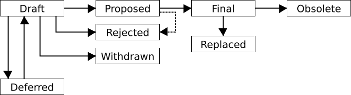

# UIP-1: Unit-e Improvement Proposal (UIP) Process

```
Author:   Cornelius Schumacher <cornelius@thirdhash.com>
Status:   Draft
Created:  2018-11-30
```

## Abstract

A Unit-e Improvement Proposal (UIP) is a design document providing information
to the Unit-e community, or describing a new feature for Unit-e or its processes
or environment. The UIP should provide a concise technical specification of the
feature and a rationale for the feature.

We intend UIPs to be the primary mechanisms for proposing new features, for
collecting community input on an issue, and for documenting the design decisions
that have gone into Unit-e. The UIP author is responsible for building consensus
within the community and documenting dissenting opinions.

Because the UIPs are maintained as text files in a versioned repository, their
revision history is the historical record of the feature proposal.

This document defines the process for creating, discussing, and approving UIPs.


## Motivation

There needs to be a process and format to have design discussions and decisions
about the Unit-e protocol and APIs. These designs affect implementations and the
network in general so they need a structured process which supports an effective
discussion and clearly communicates results.


## Specification

### Document format

The document MUST be saved in Markdown and MUST use a naming convention as:
`UIP-xxxx.md`, where `xxxx` is the number of the UIP left-padded with zeroes.

Requirements MUST be indicated as described in
[RFC2119](https://www.ietf.org/rfc/rfc2119.txt).

You can use the template [UIP-0000.md](UIP-0000.md) as a starting point which
already is formatted in the correct way.

#### Sections

Every UIP document MUST contain the following sections.

##### Title

A concise title of the UIP. The title should contain the UIP number.
Example: `# UIP-12: Fork choice rule`.

##### Preamble

Headers containing metadata about the UIP. The header block MUST be enclosed in
triple backticks to mark it up as code block. See the [template](UIP-0000.md)
for an example.

The preamble has the following fields:

* `Author`: Name and email address of author of the UIP in the format `Jane
  Smith <jsmith@example.com>`
* `Co-Author`: Name and email address of additional authors of the UIP in the
  same format as in `Author` (field can occur multiple times)
* `Status:` One of [`Draft`, `Deferred`, `Withdrawn`, `Proposed`, `Rejected`,
  `Final`, `Replaced`, or `Obsolete`] (definition of the status values is
  defined in section [UIP Life Cycle](#uip-life-cycle))
* `Created:` Creation date in the format YYYY-mm-dd
* `Superseded:` When the UIP was considered to be replaced by another UIP, in
  the format YYYY-mm-dd
* `Superseded-by:` Number of the UIP which supersedes this UIP
* `Supersedes:` Any other UIPs this UIP supersedes

`Author`, `Status` and `Created` MUST be present in all UIPs.

`Co-Author` fields MAY be added to attribute the content of an UIP to multiple
authors. The author from the `Author` field is the prime responsible person in
terms of the UIP process, though.

`Superseded` and `Superseded-by` MUST be added when UIP has status `Replaced`.
`Supersedes` MUST be added if the UIP invalidates any other UIPs.

##### Abstract

A short (~200 word) description of the technical issue being addressed.

##### Motivation

The motivation is critical for UIPs that want to change the Unit-e protocol. It
should clearly explain why the existing protocol is inadequate to address the
problem that the UIP solves.

##### Specification

The technical specification should describe the syntax and semantics of any new
feature. The specification should be detailed enough to allow competing,
interoperable implementations for any of the current Unit-e platforms.

##### Rationale

The rationale fleshes out the specification by describing what motivated the
design and why particular design decisions were made. It should describe
alternate designs that were considered and related work. The rationale should
provide evidence of consensus within the community and discuss important
objections or concerns raised during discussion.

##### Backwards compatibility

All UIPs that introduce backwards incompatibilities MUST include a section
describing these incompatibilities and their severity. The UIP MUST explain how
the author proposes to deal with these incompatibilities.

##### Reference implementation

A proposal MUST have a reference implementation before it can move from
`Draft` to `Proposed`. The terms "reference implementation" and
"proof-of-concept" can be used interchangeably here. The point is that the idea
has gone through a phase of implementation so that it is a tested idea, and
issues which only can be found when actually trying to implement it have been
found and addressed.

It is better to finish the specification and rationale first and reach consensus
on it before writing code, though.

To go from `Proposed` to `Final` there MUST be a full, released implementation.
That's the prerequisite for getting real-world adoption. The final
implementation MUST include test code and documentation appropriate for the
Unit-e protocol.

##### Copyright

All UIPs MUST be dual-licensed under
[CC0](https://creativecommons.org/publicdomain/zero/1.0/) and
[MIT](https://opensource.org/licenses/MIT).

#### Optional sections

If the UIP is updated through a pull request in a non-trivial way all changes in
comparison to the original version SHOULD be kept in a `Changelog` section.

Other sections MAY be added to provide additional context or clarity.

#### Auxiliary files

UIPs MAY include auxiliary files such as diagrams. Auxiliary files should be
included in a subdirectory for that UIP which MUST be named `files/UIP-XXXX`
where "XXXX" is the UIP number.

### Process

We MUST host all the UIPs documents on GitHub and use the pull request feature
to add new documents, this will allow to add comments and keep track of them.

For each new UIP create then a new branch with the UIP reference number and
create a pull request with master. The pull request is then the place to comment
before accepting the UIP as `Draft`.

The UIP document is updated through subsequent pull requests. This includes in
particular changes to the status of the UIP. The `Status` field in the preamble
of the document MUST reflect those changes. Discussion about acceptance of
status changes happens in the pull requests. The definition of the status and
its transitions is defined in the [UIP life cycle](#uip-life-cycle) section.

In the case of a new UIP superseding a document, the pull request for the new
UIP MUST also take care of changing the status of the document to be superseded.

#### UIP life cycle

The author is responsible for driving the UIP and establishing [rough
consensus](https://tools.ietf.org/html/rfc7282) about the proposal. The status
of the UIP reflects the different states the proposal goes through during this
process. The status MUST be recorded in the `Status` field of the preamble of
the document.

The typical paths of the status of UIPs are as follows:



New UIPs are submitted as `Draft`. This is the state where the discussion about
acceptance of the proposal is happening and the proposal might be changed to
incorporate feedback from the discussion.

Authors of a UIP may decide on their own to change the status from `Draft` to
`Withdrawn` if they retract their proposal and won't pursue it further.

Authors of a UIP may decide on their own to change the status from `Draft` to
`Deferred` if they postpone the proposal but intend to pick it up at a later
point in time.

A UIP may only change status from `Draft` to `Proposed`, when the author deems
it is complete, has a working implementation (where applicable), and has
community plans to progress it to the `Final` status.

UIPs in the `Proposed` status serve as design specification for implementations.
Implementations SHOULD note which UIPs they support.

UIPs should be changed from `Draft` or `Proposed` status to `Rejected` status,
upon request by any person, if they have not made progress in three years. Such
a UIP may be changed to `Draft` status if the author provides revisions that
meaningfully address public criticism of the proposal, or to `Proposed` status
if it meets the criteria required as described in the previous paragraphs.

A `Proposed` UIP may progress to `Final` only when specific criteria reflecting
real-world adoption have occurred. This is different for each UIP depending on
the nature of its proposed changes. Evaluation of this status change should be
objectively verifiable, and/or be discussed by the community. The UIP SHOULD
include a definition of the criteria.

When a `Final` UIP is no longer relevant, its status may be changed to
`Replaced` or `Obsolete`. If it is replaced by another UIP the status should be
changed to `Replaced` and the UIPs which supersede it MUST be noted in the
preamble. If the UIP does not apply anymore and there is no successor UIP the
state should be changed to `Obsolete`. These changes must also be objectively
verifiable and/or discussed.


## Rationale

The UIP process is an evolution of the ADR process used for recording decisions
by the Unit-e community. While the ADR is adequate for decisions on the code or
process level and is providing an immutable record of decisions for later
reference, the UIP process addresses design decisions on the protocol or API
level. They also serve as a specification and are mutable documents reflecting
the evolution of a design.

The process is inspired by the [BIP
process](https://github.com/bitcoin/bips/blob/master/bip-0002.mediawiki), which
is based on the [PEP process](https://www.python.org/dev/peps/pep-0001/). Other
similar processes are the [EIP
process](https://github.com/ethereum/EIPs/blob/master/EIPS/eip-1.md) and the
[Rust RFC process](https://github.com/rust-lang/rfcs). They all are inspired by
the [IETF RFC process](https://www.ietf.org/standards/process/).

Following a similar process as other communities should make it easier to
understand and follow the process. It also builds on the insight others have
gathered over time.

While the UIP are based on the same work flow as the BIPs there are a few
differences to the BIP process worth noting:

* It's based on the ADR process which initially was used to discuss designs, so
  some parts of the format resemble that.
* BIPs have an `Active` state for process proposals. We leave that out for UIPs
  as we use ADRs to record process decisions. UIPs should always be design
  documents.
* BIPs have a dedicated editor, while this is left open for UIPs right now. The
  assumption is that the initial team working on Unit-e will share these
  responsibilities and a more defined process can be introduced later when
  needed.
* BIP have a quite elaborate definition of what real-world adoption means to
  make a BIP `Final`. This is left open for UIPs right now as the project is in
  a much earlier stage. Details of this will have to be defined later.
* The BIP process has some specification for how to handle comments which uses
  an external Wiki. For UIPs all comments should be done through GitHub on pull
  requests or be summarized in the document itself.


## Reference implementation

UIP-1 is special because it's not a technical specification but bootstraps the
process of UIPs. In some way it can be seen as the reference implementation for
the process.

We will use this as criteria for moving the status from UIP-1 from `Draft` to
`Proposed`. Once we have moved the existing design documents and have exercised
the process by writing a new UIP and we have incorporated necessary changes we
will consider the reference implementation to be done and move to the `Proposed`
status.


## Adoption considerations

As for all other design documents we consider real-world adoption as criteria
when to move the status of UIP-1 from `Proposed` to `Final`. If at least one UIP
submitted from outside of the initial core team has moved to `Proposed` and at
least one UIP has moved to `Final` we will consider the process to be adopted
and change the status of UIP-1 to `Final`.


## Copyright

This document and all its auxiliary files are dual-licensed under
[CC0](https://creativecommons.org/publicdomain/zero/1.0/) and
[MIT](https://opensource.org/licenses/MIT).
