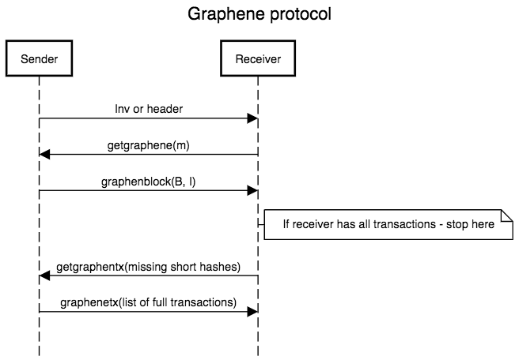

# UIP-26: Graphene - block propagation protocol

```
Author:   Aleksandr Mikhailov <aleksandr@thirdhash.com>
Status:   Proposed
Created:  2019-02-21
```

## Abstract

Graphene is a protocol for a more efficient block relay.

## Motivation

The main intent of graphene is to reduce block size. Smaller blocks
propagate faster and reduce node traffic. Graphene also scales much
better with block size, which would allow us to increase block size if
needed.

## Specification

### Definitions
`IBLT` - invertible bloom lookup table

`txpool` - all transactions available to a node. This includes `mempool` _and_ `orphanpool`

`B` - bloom filter computed for block transactions by sender

`I` - IBLT of the block transactions computed by sender

`I'` - IBLT of the receiver's txpool (filtered with `B`)

`m` - number of transactions in receiver's txpool

`FPR` - false positive rate

### Short overview

The main ingredient of graphene is using both bloom filter and invertible
bloom lookup table (IBLT). It turns out to be more efficient than using
only bloom filter or only IBLT. Sender creates bloom filter `B`
and IBLT `I` for block transactions and sends them along with some other
information(block header, prefilled transactions...).

Receiver filters its txpool using bloom filter `B` and creates new
IBLT `I'` on what is left after `B`. Then by subtracting `I-I'` receiver
is able to infer which transactions are comprising the given block.

To optimize IBLT and bloom filter parameters receiver node should
announce to sender how big its mempool is. We will call this parameter `m`

To further decrease IBLT size we store short 64bit hashes there,
instead of full 256bit hashes

Note: both IBLT and bloom filter are probabilistic data structures,
which can sometimes result in unrecoverable graphene blocks

### P2P protocol



Protocol flow upon receiving `headers` message is unchanged.

After receiving block header, receiver sends `getgraphene` message
which is parametrized with `m`.

Sender uses `m` and his txpool to consturct optimal `B` and `I` and
sends them back to receiver.

If receiver is unable to reconstruct block - it should request fallback block(either compact or legacy)

If receiver has all transactions from block - it processes block as usual. Block transfer ends.

If receiver lacks some transactions from block - it sends back a list of missing tx short hashes via `getgraphentx`.

Sender should reply on `getgraphenetx` with `graphenetx` message, carrying missing transactions.

Individual nodes can disable graphene support. The reason might be
a desire to save CPU on a very weak machine.

Sender should not respond with graphene block if requested block is
deeper than 5 - since graphene heavily relies on txpool content, it is
almost guaranteed to not reconcile for older blocks(inherited from compact blocks)

#### New messages and data structures

##### getgraphene
Used to request graphene blocks from peers.
Carries `GrapheneBlockRequest` struct:

Name | Description | Type/Size
-----|-------------|-----------
requested_block_hash | Hash of the block being requested | uint256
requester_mempool_count | Number of transactions in receiver's txpool (parameter `m`) | uint64

##### graphenblock

Carries `GrapheneBlock` struct.
Central data structure of the entire protocol. Assuming no unrecoverable
issues arise - this data structure is enough to reconstruct the full block.

Name | Description | Type/Size
-----|-------------|-----------
header | Block header | CBlockHeader, 80 bytes
nonce | Nonce used for computing short tx hashes | uint64
bloom_filter | Bloom filter `B` | CBloomFilter, size varies
IBLT | IBLT `I` | GrapheneIblt, size varies
prefilled_transactions | Transactions we expect receiver is not aware of(currently only coinbase) | vector\<CTransaction\>

`GrapheneIblt`:

Actual IBLT data. The protocol requires `I` and `I'` to have the same
amount of cells and hash functions.

Name | Description | Type/Size
-----|-------------|-----------
m_hash_table | List of `HashTableEntry` | vector\<HashTableEntry\>
m_num_hashes | Number of hash functions | uint8

`HashTableEntry`:
Entry of IBLT.

Name | Description | Type/Size
-----|-------------|-----------
count | How many times key hash resolved to this bucket | VARINT(int32_t) 1-5 bytes
key_sum | Xor of all keys for this bucket | uint64
key_check | Xor of all key checksums | uint32

Total entry size is `13-17 bytes`

##### getgraphentx
Used by receiver to request any missing transactions after graphene
block was successfully decoded.
Carries `GrapheneTxRequest` struct:

Name | Description | Type/Size
-----|-------------|-----------
block_hash | Hash of the block being requested | uint256
missing_tx_short_hashes | Set of short tx short hashes | set\<uint64\>

##### graphenetx
Carries `GrapheneTx` struct:

Name | Description | Type/Size
-----|-------------|-----------
block_hash | Hash of the block being requested | uint256
txs | List of full transactions | vector\<CTransaction\>

### Interoperability with compact block

Graphene does not aim to replace compact block, but to coexist and improve resulting performance:

Compact block high bandwidth relaying remains as is.

When receiver requests graphene block (low bandwidth relaying),
sender should evaluate which block is smaller (graphene or compact) and send it.

For now we are not providing high bandwidth graphene mode, because it is
harder to design it efficiently: in high perf mode blocks are sent
directly, without invs/headers. But graphene blocks still need parameter
`m` to be effective. So we need to synchronize it separately.

### Short hash
Short hash computation is inherited from compact block with one
exception: we use 64bit hashes instead of 48bit.

## Reference implementation

[Unit-e pull request](https://github.com/dtr-org/unit-e/pull/566)


## Copyright

This document and all its auxiliary files are dual-licensed under
[CC0](https://creativecommons.org/publicdomain/zero/1.0/) and
[MIT](https://opensource.org/licenses/MIT).
